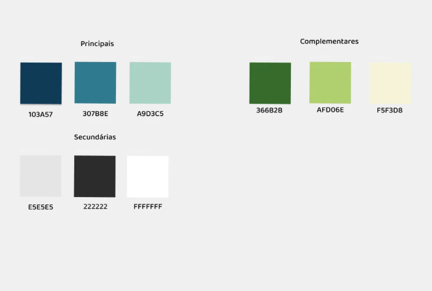

# 🎨 Paleta de Cores – Sistema Marketplace

 

## Resumo da Paleta de Cores

A paleta gira em torno de tons de azul e verde, com tons neutros de apoio. Ela transmite:.

### 💼 Profissionalismo e Confiança

Os azuis principais (como o **Prussian Blue** #103A57) são frequentemente usados em sistemas de gestão e ambientes corporativos por evocarem segurança, estabilidade e inteligência.

### 🧘‍♀️ Calma e Clareza

Tons como o **Teal Blue** #307B8E e o **Pastel Blue** #A9D3C5 trazem leveza e serenidade — ótimos para interfaces que precisam ser intuitivas e evitar sobrecarga visual.

### 🌱 Equilíbrio e Sustentabilidade

Os verdes, como o **Mughal Green** #366B2B, comunicam crescimento, equilíbrio e renovação — ideais para sistemas que lidam com processos, progresso e organização.

### ⚪ Neutralidade e Leveza

A cor neutra #E5E5E5 adiciona suavidade e ajuda a destacar os tons principais sem competir com eles, mantendo a interface leve e acessível.

---

## 📘 Guia de Aplicação da Paleta de cores

### Cores Principais

Usadas na identidade visual e nos elementos mais importantes da interface.

| Cor         | Uso Sugerido                                          |
|-------------|-------------------------------------------------------|
| `#103A57`   | Cabeçalhos, barra lateral, footer, botões primários   |
| `#307B8E`   | Estados ativos, ícones principais, hovers             |
| `#A9D3C5`   | Fundos suaves, cards, realces leves                   |

---

### Cores Complementares

Destacam ações específicas ou categorias sem competir com o azul.

| Cor         | Uso Sugerido                                          |
|-------------|-------------------------------------------------------|
| `#366B2B`   | Indicadores de sucesso, botões secundários            |
| `#AFD06E`   | Destaques sutis, Rótulos de status,                   |
| `#F5F3D8`   | Fundos de alertas leves, áreas de ajuda               |

---

### Cores Secundárias

Fornecem base visual para leitura e estruturação.

| Cor         | Uso Sugerido                                          |
|-------------|-------------------------------------------------------|
| `#E5E5E5`   | Backhround geral, bordas, separadores                 |
| `#222222`   | Texto principal                                       |
| `#FFFFFF`   | Background de componentes e páginas                   |

---