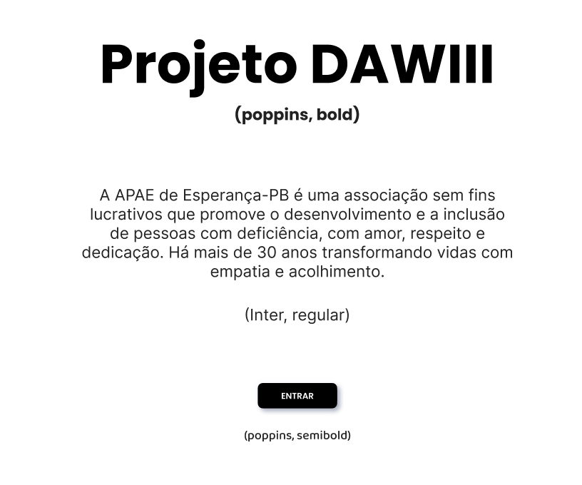

# 🖋️ Guia Tipográfico e Hierarquia Visual do Projeto de DAWIII

## 🔤 Fontes Utilizadas

- **Primária (Títulos e Elementos de Destaque):** `Poppins`
  - Estilo geométrico, moderno e amigável.
  - Uso: Títulos, botões principais, valores em destaque e categorias.

- **Secundária (Texto Corrido e UI):** `Inter`
  - Alta legibilidade em tamanhos menores.
  - Uso: Parágrafos, descrições, inputs, cards, mensagens do sistema.

- **Exemplo**

  

---

## 📐 Hierarquia de Tipografia

| Nível   | Aplicação                                            | Fonte   | Peso      | Tamanho | Linha | Espaço letras |
|---------|------------------------------------------------------|---------|-----------|---------|--------|----------------|
| H1      | Título principal de tela                             | Poppins | Bold      | 32px    | 40px   | -1%            |
| H2      | Subtítulos ou seções internas                        | Poppins | SemiBold  | 24px    | 32px   | -0.5%          |
| H3      | Títulos de cards ou blocos                           | Poppins | Medium    | 20px    | 28px   | 0%             |
| H4      | Rótulos de campos e sessões menores                  | Inter   | Medium    | 16px    | 24px   | 0%             |
| Body 1  | Texto corrido / descrições                           | Inter   | Regular   | 16px    | 24px   | 0%             |
| Body 2  | Texto auxiliar / status                              | Inter   | Regular   | 14px    | 20px   | 0%             |
| Caption | Notas pequenas / dicas                               | Inter   | Regular   | 12px    | 16px   | +2%            |
| Button  | Botões principais e ações                            | Poppins | SemiBold  | 16px    | 20px   | +1%            |
---

## 🔁 Boas Práticas Tipográficas

- ✅ **Consistência:** Use apenas `Poppins` e `Inter` no projeto.
- ✅ **Hierarquia clara:** H1 > H2 > H3 > Body.
- ✅ **Legibilidade:** Evite textos menores que 12px.
- ✅ **Espaçamento:** Use linha de pelo menos `1.5x` da altura da fonte.
- ✅ **Destaques controlados:** Use **bold** ou cor para destaque, mas com moderação.

---

